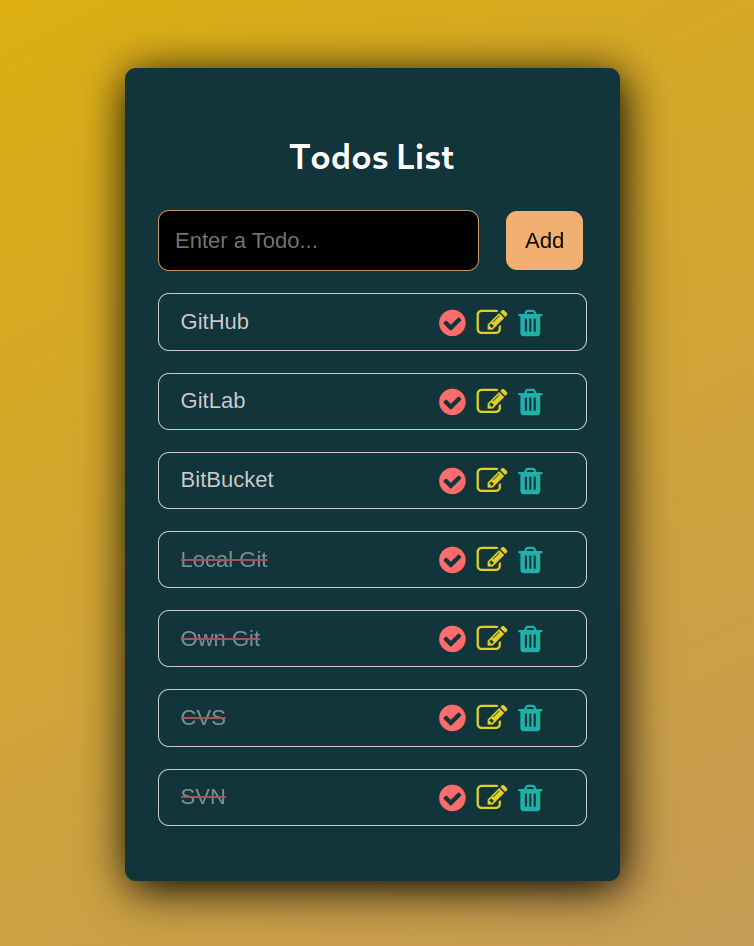

# Reactjs Todo List (CRUD App)

Build A Todo List App with React from Scratch (Including Hooks)



## Try & Demo

```bash
$ git clone https://github.com/BaseMax/reactjs-todo-list
$ cd reactjs-todo-list
$ npm install
$ npm start
```

## Similar Repository

https://github.com/BaseMax/reactjs-todolist

### Acknowledgment

I saw an [Youtube video](https://www.youtube.com/watch?v=dD0MdMRVHoo) and It's encouraged me to write a similar project myself.

© Copyright Max Base
